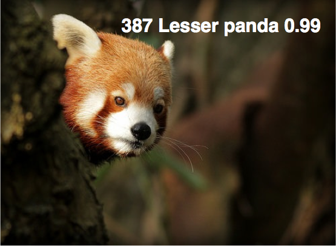
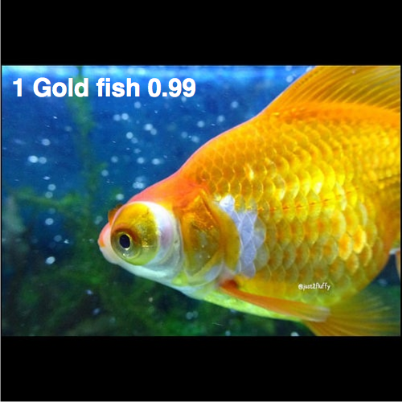
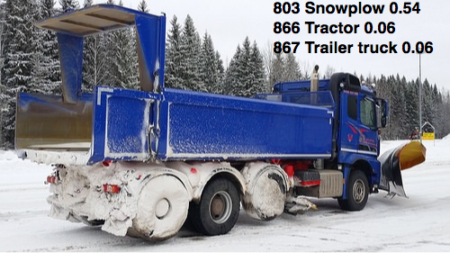
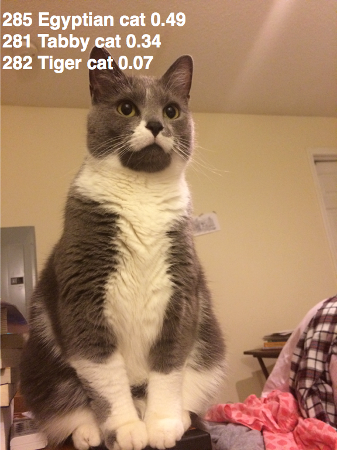
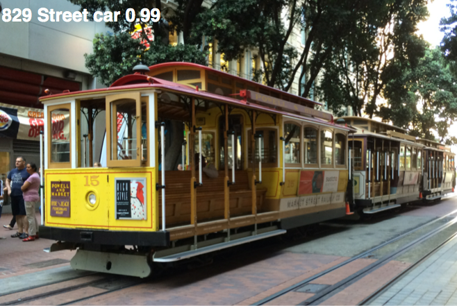

# GoogLeNet for Image Classification


- TensorFlow implementation of [Going Deeper with Convolutions](https://research.google.com/pubs/pub43022.html) (CVPR'15). 
- Architecture of GoogLeNet from the paper:


## Requirements
- Python 3.3+
- [Tensorflow 1.0+](https://www.tensorflow.org/)
- [TensorCV](https://github.com/conan7882/DeepVision-tensorflow)

## Implementation Details

- The GoogLeNet model is defined in [`lib/nets/googlenet.py`](lib/nets/googlenet.py).
- Inception module is defined in [`lib/models/inception.py`](lib/models/inception.py).
- An example of image classification using pre-trained model is in [`example/pre_trained.py`](example/pre_trained.py).
- The pre-trained model on ImageNet can be downloaded [here](http://www.deeplearningmodel.net/).
- When testing the pre-trained model, images are rescaled so that the shorter dimension is 224. This is not the same as the original paper which is an ensemle of 7 similar models using 144 224x224 crops per image for testing. So the performance will not be as good as the original paper. 


## Results
result of VGG19 for the same images can be found [here](https://github.com/conan7882/VGG-tensorflow#results). 

**The pre-processing of images for both experiments are the same.** 

- ### Image classification on ImageNet
<div align='left'>
  
  
  
</div>

- ### Images from my photo collection
<div align='left'>
  
  
</div>

## Usage
### Download pre-trained model
Download the pre-trained parameters [here](http://www.deeplearningmodel.net/).
### Config path
All directories are setup in [`example/setup_env.py`](example/setup_env.py).

- `PARA_DIR` is the path of the pre-trained model.
- `SAVE_DIR` is the directory to save graph summary for tensorboard. 
- `DATA_DIR` is the directory to put testing images.

### ImageNet Classification
Put test image in folder `setup_env.DATA_DIR`, then go to `example/` and run the script:

```
python pre_trained.py --type IMAGE_FILE_EXTENSION(.jpg or .png or other types of images)
```
       
   The output are the top-5 class labels and probabilities, and the top-1 human label. The structure of GoogLeNet can be viewed through TensorBoard and the summary file is saved in `setup_env.SAVE_DIR`.
   
**Note that the output label is started from 0, so label=l corresponds to the (l+1)th row in [`data/imageNetLabel.txt`](data/imageNetLabel.txt).**

